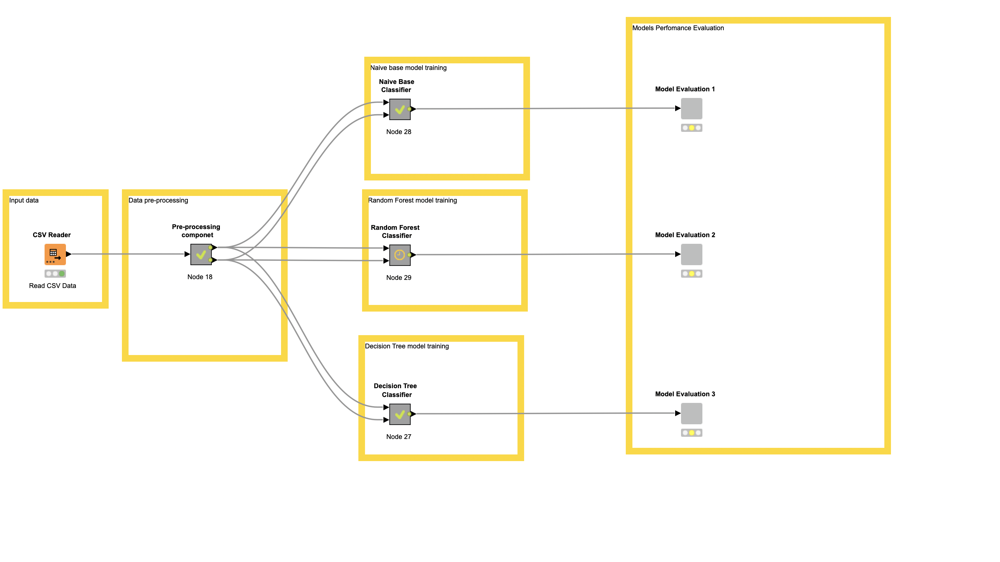
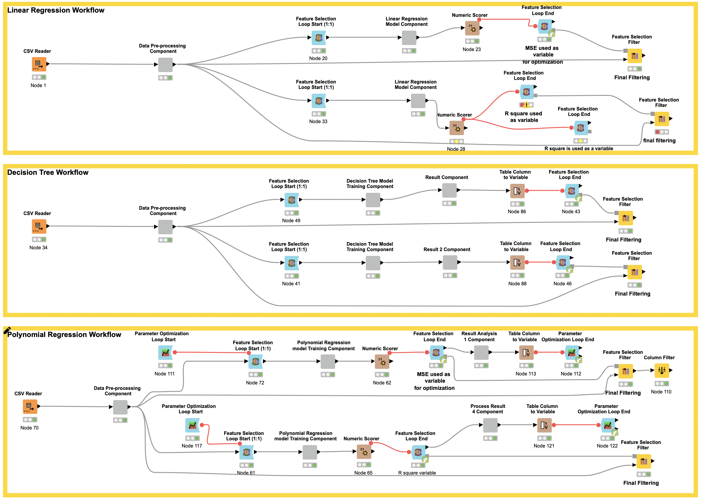

# Knime-ML-Classification-Regression
KNIME | Machine Learning | Income Classification | Housing Price Regression | Data Preprocessing | Model Optimization | PDF Report

# Machine Learning Analysis: Income Classification & Housing Price Prediction


## 📌 Project Overview
This repository contains a KNIME-based machine learning pipeline analyzing:
1. **Income Classification** (`adult.csv`): Predicts if income exceeds $50k/year

<div style="display: flex; justify-content: center; margin-top: 20px;">
      <div style="width: 80%;">
         <h4 style="text-align: center;">Workflow of Income Classification</h4>
         
      </div>
   </div>

2. **Housing Regression** (`Boston.csv`): Predicts Boston home values (MEDV)

<div style="display: flex; justify-content: center; margin-top: 20px;">
      <div style="width: 80%;">
         <h4 style="text-align: center;">Workflow of Income Classification</h4>
         
      </div>
   </div>

## 🛠️ Technical Components
| Component | Description |
|-----------|-------------|
| `workflows/` | KNIME workflows (.knwf) for both tasks |
| `data/` | Input datasets (adult.csv, Boston.csv) |
| `images/` | Saved diagram of the workflow (.png files) |
| `report.pdf` | Detailed analysis document |

## 🔍 Key Features
### Classification Task (Income Prediction)
- **Data Preprocessing**:
  - Age binning (Young Adult → Late Adulthood)
  - Workclass simplification ("Never-worked" + "Without-pay" → "Not-Working")
  - Capital gain/loss discretization (None/Small/Big)
  
- **Models Compared**:
  | Model | Accuracy | Precision (>50K) | Recall (>50K) |
  |-------|----------|------------------|---------------|
  | Naive Bayes | 83.9% | 0.74 | 0.554 |
  | Decision Tree | 80.6% | 0.588 | 0.768 |
  | Random Forest | 82.5% | 0.678 | 0.577 |

- **Optimal Model**: Naive Bayes (84% accuracy)

### Regression Task (Housing Prices)
- **Feature Selection**:
  - Removed low-variance features
  - Eliminated high-correlation pairs (threshold: 0.8)
  
- **Models Compared**:
  | Model | MSE | R² |
  |-------|-----|----|
  | Linear Regression | 0.29 | 0.662 |
  | Decision Tree | 21.08 | 0.675 |
  | Polynomial Regression | 0.322 | 0.679 |

- **Optimal Model**: Polynomial Regression (R²=0.679)

## 🚀 How to Use
## 1. **Requirements**:
   - KNIME Analytics Platform ≥4.7
   - Install extensions:
**KNIME Installation Guide**:
  
**Windows & macOS**:

1. Download the latest version of KNIME from the official website:  
[https://www.knime.com/downloads](https://www.knime.com/downloads)
2. Extract the downloaded archive (if applicable).
3. Run the **KNIME Analytics Platform** executable (`knime.exe` on Windows, `knime` on macOS).
4. (Optional) Install additional extensions via **File** → **Install KNIME Extensions**.

#### Linux
1. Download the `.tar.gz` package from:  
[https://www.knime.com/downloads](https://www.knime.com/downloads)
2. Extract the archive:
```bash
tar -xvzf knime_*.tar.gz
```

## 2. **Run Workflows**:
   - Open `workflows/Income_Classification_workflow.knwf`
   - Execute all nodes (F7)

## 3. **Reproduce Analysis**:
   - Written report and figures found `report/report.pdf`
   